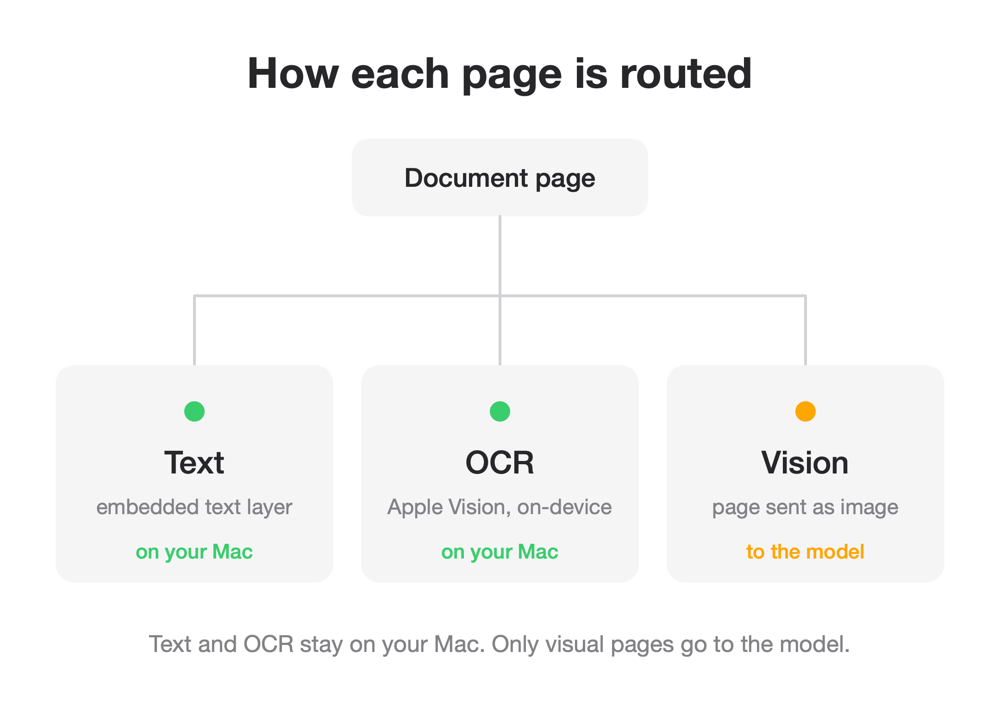

# LocalContextRouter

Decide locally how each page of a document should reach a multimodal model:
as extracted text, on-device OCR, or a rendered image. That keeps you from
paying for vision tokens on pages that are only text.

A multimodal model reads a PDF by pulling its text *and* rendering every page to
an image, then billing for both. On a text page that image runs roughly
1,300 to 4,800 tokens while the same page as plain text is 400 to 800. For a
text-dominant document that is several times the cost for nothing extra.
LocalContextRouter does the cheap work on your machine first and tells you what
each page actually needs.

It does not call a model. It returns a per-page decision and the text to send;
your application still makes the call.

## How it decides



For each page:

- A usable text layer that is mostly prose: use the extracted text.
- A text layer dominated by a table, chart, or diagram: send the page as an
  image, where the layout carries the meaning.
- No usable text, such as a scan or a photo: recognize it on-device with
  Apple's Vision framework.

The result also reports how many tokens you saved against sending every page as
an image.

## Install

```sh
pip install localcontextrouter
```

macOS only. The wheel bundles a universal (Apple Silicon and Intel) OCR binary,
so text recognition works with no extra setup.

## Command line

```sh
localctx invoice.pdf
localctx invoice.pdf --json
localctx scan.png
```

`localctx invoice.pdf` prints each page, the source chosen for it, and the
tokens saved:

```
Document: invoice.pdf (3 pages)
Tokens saved vs sending every page as an image: 3085

Page 1 [text]
ACME Corp, Invoice #4471 ...

Page 2 [vision]
Quarterly results by segment ...

Page 3 [ocr]
SCANNED RECEIPT TOTAL 42.00
```

Add `--vision-dir DIR` to render the pages that should go to the model as images
into `DIR`; their paths are then listed in the output and the JSON.

## In code

```python
from localcontextrouter import route_pdf, Source

result = route_pdf("invoice.pdf")
for page in result.pages:
    if page.source is Source.VISION:
        send_image(page.index)     # the page's meaning is visual
    else:
        send_text(page.text)       # extracted or recognized text

print(result.tokens_saved)
```

Every page also carries an estimate of its cost both ways, as
`page.tokens.text_tokens` and `page.tokens.image_tokens`.

## As an agent skill

`local-context-router` is an Agent Skill in the open `SKILL.md` format, so it
works in Claude Code and other compatible agents. It lives in this repository
under `.claude/skills/local-context-router`; copy that folder into your agent's
skills directory:

```sh
cp -r .claude/skills/local-context-router ~/.claude/skills/
```

With the package installed, the agent runs the preflight on any PDF or image you
share, then uses the text for the cheap pages and attaches images only for the
visual ones.

## Requirements and scope

- macOS 11 or newer. Recognition uses the Apple Vision framework and needs a
  normal macOS graphics environment; it will not run inside a headless sandbox
  that lacks one.
- Python 3.10 or newer.
- The scope is per-page routing, on-device OCR, and a token estimate. Retrieval
  over very large documents is out of scope.

## License

MIT. See [LICENSE](LICENSE).
